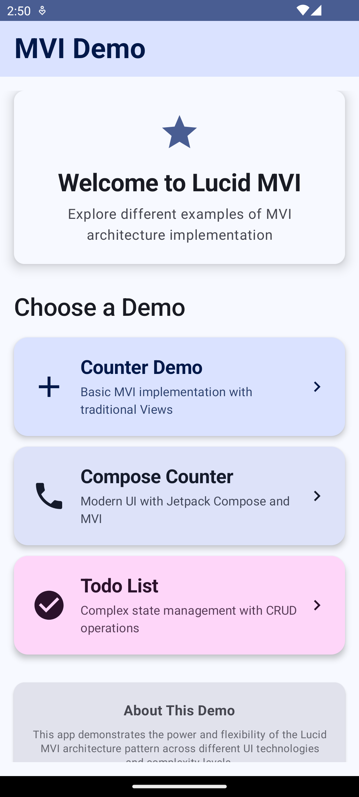
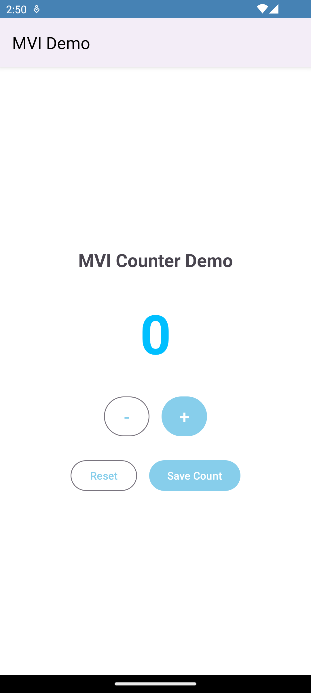
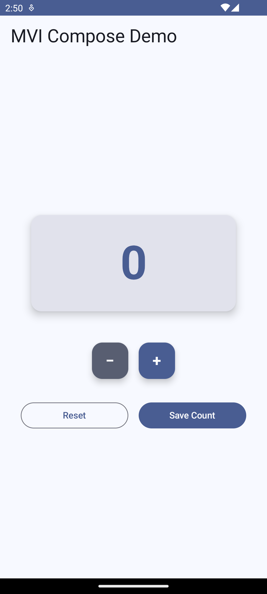
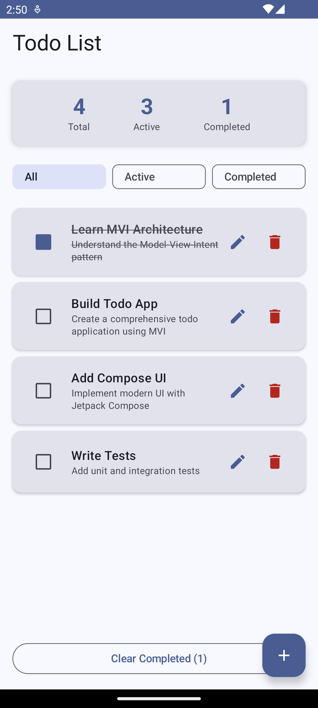

#  Lucid-MVI

[](https://github.com/greathousesh/Lucid-MVI/releases)
[](https://jitpack.io/#greathousesh/Lucid-MVI)
[](https://kotlinlang.org)
[](https://kotlinlang.org/docs/coroutines-overview.html)
[](https://android-arsenal.com/api?level=24)
[](https://developer.android.com/jetpack/compose)
[](LICENSE)
[](https://github.com/greathousesh/Lucid-MVI/actions)

This is the Android SDK for **Lucid MVI**, a lightweight, reactive, and type-safe MVI (Model-View-Intent) architecture framework designed for modern Android development.

It provides managed integration with reactive state management, predictable unidirectional data flow, and comprehensive support for both traditional Views and Jetpack Compose.

**Functionalities:**

* 🏗️ **Managed integration** with reactive state management
* 📦 **Lightweight architecture** with unidirectional data flow  
* 🔄 **Automatic state synchronization** for predictable app behavior
* 🧪 **Built-in testing support** with pure functional components
* 📱 **Jetpack Compose ready** with first-class integration
* ⚡ **Coroutines-based** async operations and effect handling

## Usage

### Adding the package dependency

The latest release of the SDK is available on JitPack.

Add the following dependency to your gradle file to use it:

```kotlin
implementation("com.github.greathousesh:Lucid-MVI:0.0.6")
```

Where `0.0.6` is the most recent version of this SDK.

Released versions can be found under "Releases" within this repository.

### Creating the Lucid MVI instance

You can create your MVI components using the `BaseMVIViewModel` class like this:

```kotlin
val viewModel = CounterViewModel(
    reducer = CounterReducer(),
    effectHandler = CounterEffectHandler()
)
```

Where `CounterViewModel` extends `BaseMVIViewModel` with your state, actions, effects, and events. The framework provides managed integration with reactive state management and automatic lifecycle handling.

_Note: The Lucid MVI framework has been designed to work as ViewModels in your Activities/Fragments. Each ViewModel instance manages its own state independently._

### Initialization strategy

`viewModel.sendAction()` is the primary method to trigger state changes by dispatching actions to the reducer. The framework automatically handles state updates and effect processing.

The alternative approach is to use `viewModel.sendEffect()` for triggering side effects directly. To maintain predictable state flow, the recommended approach is to always start with actions and let the reducer determine when effects should be triggered.

### Setting the state

The state is managed through immutable data classes that represent your application state at any moment. State changes are triggered by actions processed through pure reducer functions.

The Lucid MVI SDK supports reactive state observation through StateFlow:

```kotlin
viewModel.stateFlow.collect { state ->
    // Update UI based on new state
}
```

### Processing actions

**Once your ViewModel is initialized**, you can dispatch actions using the `sendAction` method. Actions represent user intents and are processed by the reducer to produce new states.

The method `sendAction` will trigger the reducer to process the action and update the state accordingly.

```kotlin
val newState = viewModel.sendAction(CounterAction.Increment)
// State is automatically updated and emitted to observers
```

### Handling effects

Effects represent side operations like network calls, database operations, or other async tasks. You can trigger effects using the `sendEffect` method.

All state data and context information is available to the EffectHandler for processing side effects.

```kotlin
viewModel.sendEffect(CounterEffect.SaveCount)
```

The Lucid MVI SDK has support for automatic effect handling through the `EffectHandler` interface. This provides a clean separation between state management and side effect processing.

### Event handling

Events represent one-time occurrences that should be handled by the UI, such as showing toasts, navigation, or error messages.

```kotlin
viewModel.eventFlow.collect { event ->
    when (event) {
        is CounterEvent.ShowMessage -> showToast(event.message)
        is CounterEvent.NavigateToDetail -> navigate(event.id)
    }
}
```

### Logging

By default, the Lucid MVI SDK provides structured logging for state changes and effect processing. You can customize logging behavior through the ViewModel configuration.

To enable detailed logging for debugging, you can override logging methods in your ViewModel implementation.

## Demo Application

This repository includes a comprehensive demo app showcasing MVI in action:

| Demo | Tech Stack | Complexity | Learning Focus |
|------|------------|------------|----------------|
| 🏠 **HomeActivity** | Material 3 Navigation | ⭐ | App structure & navigation |
| 🧮 **CounterActivity** | Traditional Views | ⭐⭐ | MVI basics & state management |
| 📱 **CounterComposeActivity** | Jetpack Compose | ⭐⭐⭐ | Modern UI with MVI |
| ✅ **TodoActivity** | Complex State Logic | ⭐⭐⭐⭐ | Real-world MVI patterns |

### Screenshots
<p align="center">
  
  
  
  
</p>

## Installation

### Adding the package dependency

The latest release of the SDK is available on JitPack.

Add JitPack repository to your project's `build.gradle.kts`:

```kotlin
allprojects {
    repositories {
        google()
        mavenCentral()
        maven { url = uri("https://jitpack.io") }
    }
}
```

Add dependency to your module's `build.gradle.kts`:

```kotlin
dependencies {
    implementation("com.github.greathousesh:Lucid-MVI:0.0.6")
}
```

Where `0.0.6` is the most recent version of this SDK.

Released versions can be found under "Releases" within this repository.

### Alternative: GitHub Packages

See [GitHub Packages setup guide](https://docs.github.com/en/packages/working-with-a-github-packages-registry/working-with-the-gradle-registry) for authentication setup.

## Quick Start

### 1. Define Your MVI Components

```kotlin
// State - represents your app's state at any moment
data class CounterState(
    val count: Int = 0,
    val isLoading: Boolean = false,
    val error: String? = null
)

// Actions - represent user intents
sealed class CounterAction {
    object Increment : CounterAction()
    object Decrement : CounterAction()
    object Reset : CounterAction()
}

// Effects - represent side effects (async operations)
sealed class CounterEffect {
    object SaveCount : CounterEffect()
}

// Events - represent one-time UI events
sealed class CounterEvent {
    object CountSaved : CounterEvent()
    data class ShowError(val message: String) : CounterEvent()
}
```

### 2. Implement Reducer and EffectHandler

```kotlin
class CounterReducer : StateReducer<CounterState, CounterAction> {
    override fun reduce(state: CounterState, action: CounterAction): CounterState {
        return when (action) {
            CounterAction.Increment -> state.copy(count = state.count + 1)
            CounterAction.Decrement -> state.copy(count = state.count - 1)
            CounterAction.Reset -> state.copy(count = 0)
        }
    }
}

class CounterEffectHandler : EffectHandler<CounterState, CounterAction, CounterEffect, CounterEvent> {
    override suspend fun handle(
        state: CounterState,
        effect: CounterEffect,
        dispatch: suspend (CounterAction) -> Unit,
        emit: suspend (CounterEvent) -> Unit
    ) {
        when (effect) {
            CounterEffect.SaveCount -> {
                try {
                    // Simulate API call
                    delay(1000)
                    emit(CounterEvent.CountSaved)
                } catch (e: Exception) {
                    emit(CounterEvent.ShowError(e.message ?: "Unknown error"))
                }
            }
        }
    }
}
```

### 3. Create ViewModel

```kotlin
class CounterViewModel : BaseMVIViewModel<CounterState, CounterAction, CounterEffect, CounterEvent>(
    reducer = CounterReducer(),
    effectHandler = CounterEffectHandler()
) {
    override fun initialState(): CounterState = CounterState()
    
    // Public API
    fun increment() = sendAction(CounterAction.Increment)
    fun decrement() = sendAction(CounterAction.Decrement)
    fun reset() = sendAction(CounterAction.Reset)
    fun saveCount() = sendEffect(CounterEffect.SaveCount)
}
```

### 4. Use in UI

<details>
<summary><strong>🎨 Jetpack Compose (Recommended)</strong></summary>

```kotlin
@Composable
fun CounterScreen(viewModel: CounterViewModel = viewModel()) {
    val state by viewModel.stateFlow.collectAsStateWithLifecycle()
    val context = LocalContext.current
    
    // Handle one-time events
    LaunchedEffect(viewModel) {
        viewModel.eventFlow.collect { event ->
            when (event) {
                CounterEvent.CountSaved -> {
                    Toast.makeText(context, "Count saved!", Toast.LENGTH_SHORT).show()
                }
                is CounterEvent.ShowError -> {
                    Toast.makeText(context, event.message, Toast.LENGTH_LONG).show()
                }
            }
        }
    }
    
    // UI
    Column(
        horizontalAlignment = Alignment.CenterHorizontally,
        verticalArrangement = Arrangement.Center,
        modifier = Modifier.fillMaxSize()
    ) {
        Text(
            text = state.count.toString(),
            style = MaterialTheme.typography.headlineLarge
        )
        
        Row {
            Button(onClick = viewModel::decrement) { Text("-") }
            Spacer(modifier = Modifier.width(16.dp))
            Button(onClick = viewModel::increment) { Text("+") }
        }
        
        Button(
            onClick = viewModel::reset,
            modifier = Modifier.padding(top = 16.dp)
        ) {
            Text("Reset")
        }
        
        if (state.isLoading) {
            CircularProgressIndicator(modifier = Modifier.padding(top = 16.dp))
        }
    }
}
```

</details>

<details>
<summary><strong>🎭 Traditional Views</strong></summary>

```kotlin
class MainActivity : AppCompatActivity() {
    private val viewModel: CounterViewModel by viewModels()
    private lateinit var binding: ActivityMainBinding
    
    override fun onCreate(savedInstanceState: Bundle?) {
        super.onCreate(savedInstanceState)
        binding = ActivityMainBinding.inflate(layoutInflater)
        setContentView(binding.root)
        
        setupUI()
        observeState()
        observeEvents()
    }
    
    private fun setupUI() {
        binding.incrementButton.setOnClickListener { viewModel.increment() }
        binding.decrementButton.setOnClickListener { viewModel.decrement() }
        binding.resetButton.setOnClickListener { viewModel.reset() }
    }
    
    private fun observeState() {
        lifecycleScope.launch {
            viewModel.stateFlow.collect { state ->
                binding.countText.text = state.count.toString()
                binding.progressBar.isVisible = state.isLoading
            }
            }
        }
        
    private fun observeEvents() {
        lifecycleScope.launch {
            viewModel.eventFlow.collect { event ->
                when (event) {
                    CounterEvent.CountSaved -> {
                        Toast.makeText(this@MainActivity, "Count saved!", Toast.LENGTH_SHORT).show()
                    }
                    is CounterEvent.ShowError -> {
                        Toast.makeText(this@MainActivity, event.message, Toast.LENGTH_LONG).show()
                    }
                }
            }
        }
    }
}
```

</details>

## Architecture

Lucid MVI follows a strict unidirectional data flow:

```
┌─────────────┐    Action     ┌──────────────┐    New State    ┌─────────────┐
│     UI      │──────────────▶│   ViewModel  │────────────────▶│    State    │
│             │               │              │                 │             │
│             │◀──────────────│              │◀────────────────│             │
└─────────────┘    Event      └──────────────┘                 └─────────────┘
                                      │                                ▲
                                      │ Effect                         │
                                      ▼                                │
                               ┌──────────────┐     Action             │
                               │ EffectHandler│────────────────────────┘
                               └──────────────┘
```

## Roadmap

- [x] ~~Compose integration support~~
- [ ] Debug tools and logging
- [ ] Kotlin Multiplatform support
- [ ] State persistence helpers
- [ ] Testing utilities
- [ ] Performance monitoring tools


## About

Lucid MVI is a modern Android architecture framework that brings predictable state management to your applications. Built with Kotlin Coroutines and designed for both traditional Views and Jetpack Compose, it provides a clean, testable, and scalable foundation for Android development.

### Key Benefits

| Benefit | Description |
|---------|-------------|
| **Predictable** | State changes are always triggered by actions, making app behavior predictable |
| **Debuggable** | Unidirectional data flow makes it easy to trace bugs and understand state changes |
| **Testable** | Pure functions and clear separation of concerns make testing straightforward |
| **Scalable** | Handles complex state management and async operations elegantly |
| **Maintainable** | Clear architecture patterns make code easy to understand and modify |

### Requirements

- **Minimum SDK**: API 24 (Android 7.0)
- **Target SDK**: API 36
- **Kotlin**: 2.0.21+
- **Coroutines**: 1.9.0+
- **Compose**: 1.7.6+ (optional)

### Resources

- 📖 [**Complete Wiki**](WIKI.md) - Comprehensive framework documentation
- 🎯 [**Quick Start Guide**](#quick-start) - Get up and running in 5 minutes
- 🏗️ [**Architecture Guide**](WIKI.md#architecture-deep-dive) - Deep dive into MVI patterns
- 🧪 [**Testing Guide**](WIKI.md#best-practices) - Best practices for testing MVI
- 📱 [**Compose Integration**](WIKI.md#quick-start) - Modern UI with Jetpack Compose

### License

Apache-2.0 license

### Contributing

We welcome contributions! Please see our [Contributing Guidelines](CONTRIBUTING.md) for details.

### Development Setup

1. Clone the repository
2. Open in Android Studio Arctic Fox or later
3. Run `./gradlew check` to verify setup
4. Run the demo app to see examples

---

<p align="center">
  <strong>Built with ❤️ for the Android community</strong><br>
  <a href="https://github.com/greathousesh/Lucid-MVI/issues">Report Issues</a> •
  <a href="https://github.com/greathousesh/Lucid-MVI/discussions">Join Discussions</a> •
  <a href="https://github.com/greathousesh/Lucid-MVI/wiki">Read Wiki</a>
</p>